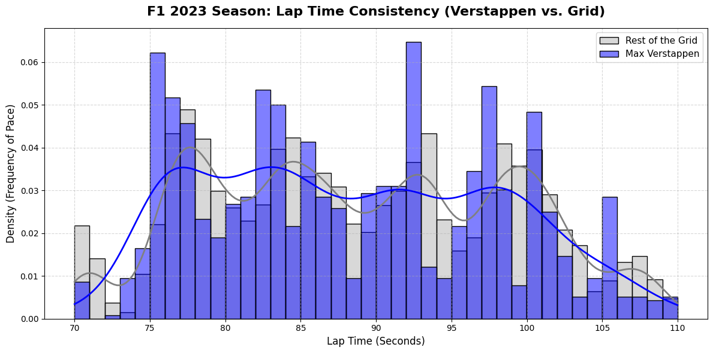

# F1 2023: Verstappen vs. the Grid — A Pace & Consistency Analysis

An exploratory data analysis comparing Max Verstappen's race pace and lap-time
consistency against the rest of the Formula 1 grid across the 2023 season — and a
demonstration of why a naive consistency metric gives the *wrong* answer here.



## The question

In 2023 Verstappen won 19 of 22 races. Win counts tell you *that* he dominated, not *how*.
This project asks two measurable questions:

> Across the 2023 season, was Verstappen faster than the field on a typical lap —
> and was he also **more consistent** (a tighter spread of lap times)?

The pace question has a clean answer. The consistency question turned out to be a trap,
which is where this analysis gets interesting.

## Data

- **Source:** Kaggle *Formula 1 World Championship (1950–2024)* dataset by Rohan Rao
  (Ergast-derived): https://www.kaggle.com/datasets/rohanrao/formula-1-world-championship-1950-2020
- **Files used:** `drivers.csv`, `races.csv`, `lap_times.csv`.
- **Scope:** the 2023 season only (`races.year == 2023`).

> Colab: upload the three CSVs to `/content/`. Local: change the paths at the top of the script.

## Method

1. **Filter to 2023** and keep only that season's laps.
2. **Isolate Verstappen** (`driverRef == 'max_verstappen'`) vs. the rest of the grid.
3. **Clean the laps.** Convert milliseconds to seconds and keep only **70–110 s** laps,
   removing pit-stop, safety-car, and red-flag laps — leaving *green-flag racing pace*.
4. **Two consistency measures**, because the obvious one is misleading:
   - **Pooled:** standard deviation of all laps, all circuits together.
   - **Per-circuit, driver-vs-driver:** within each race, compute *every* driver's own
     lap-to-lap std, then compare Verstappen's spread to the *typical* driver's spread at
     that same circuit, and average across the season. This removes circuit variance and
     compares like with like.

## Findings

### Pace — Verstappen was dominant

Comparing median lap times within each race and averaging across the season, Verstappen was
**~1.07 s per lap faster** than the typical driver — a commanding margin over a race distance.

*(A simple pooled median understates this at 0.51 s, because pooling mixes circuits and
dilutes the gap. The per-race figure is the honest one.)*

### Consistency — the naive metric gives the wrong answer

| Method | Result | Verdict |
|---|---|---|
| Pooled std, all circuits | 3.1% **tighter** than the field | Misleading artefact |
| Per-circuit, driver-vs-driver | ~11% **wider** than a typical driver | The defensible answer |

The pooled figure suggests Verstappen was *more* consistent. But that standard deviation
(~9.5 s) is dominated by circuit-to-circuit differences — a Monaco lap (~75 s) and a Spa lap
(~105 s) pooled together — not by driver behaviour.

Once each driver is measured against the typical driver **at the same circuit**, the result
**flips**: Verstappen's lap-to-lap spread averaged **1.11× the field's** — about 11% *wider*.
He was the more consistent driver in a slim majority of races (**12 of 21**), but a handful
of high-variance races pull his season average above the field's.

### Reading it — variance as a symptom of dominance

A wider spread is not obviously "worse driving." A driver a second a lap clear of the field
can afford to *manage* a race — backing off to protect tyres and engine, then banging in a
fast lap late. That mechanically widens his lap-time distribution. So Verstappen's higher
variance may be a **symptom of dominance, not sloppiness**.

This is a hypothesis the current data can't confirm — but the headline result stands
regardless: **the naive pooled metric would have led to the opposite, wrong conclusion.**

## Tech stack

- **Python** — pandas (filtering, cleaning, group-wise `groupby` normalization, summary stats)
- **Visualization** — matplotlib + seaborn (histogram / KDE)

## How to run

```bash
pip install pandas matplotlib seaborn
python F1_analysis.py
```

The script prints both the pooled and per-circuit-normalized statistics, then renders the
distribution plot (`verstappen_pace_2023.png`).

## Limitations & next steps

- **Pace ignores the car.** The honest reading is "Verstappen + Red Bull vs. the field," not
  driver skill alone. Comparing against team-mate Pérez would isolate the driver effect.
- **The "variance = dominance" reading is untested.** Confirming it needs stint, tyre, and
  race-situation data (e.g. FastF1) to separate deliberate pace management from genuine
  inconsistency.
- **Mean vs. typical race.** The season-average spread ratio is pulled up by a few
  high-variance races; reporting the *median* race ratio alongside it would give a more
  outlier-robust central estimate.
- **Further extensions:** tyre-degradation curves, qualifying vs. race pace, and a
  full per-circuit consistency ranking across all drivers.
